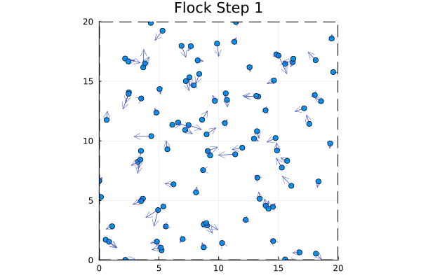
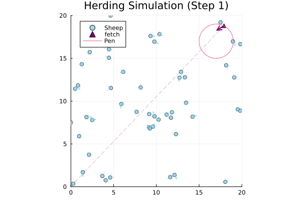

# Flocking ABM Simulation in Julia

This repository contains a simple implementation of a ABM flocking simulation in Julia. The simulation is based on the Boids algorithm, which was introduced by Craig Reynolds in 1986. The algorithm simulates the flocking behavior of birds by defining three simple rules that each boid follows:

1. **Separation**: Boids avoid collisions with their neighbors.
2. **Cohesion**: Boids move towards the center of mass of their neighbors
3. **Alignment**: Boids steer towards the average heading of their neighbors

The simulation is implemented in Julia using the `Plots` package for visualization. The code is organized into the following files:

- `flocking.jl`: Contains the main simulation code, with the implementation of the Boids algorithm
- `herding.jl`: Another type of agent is introduced, which is a herder. The herder interacts with the boids in a different way than the boids interact with each other and has a certain set of possible behaviors it can adopt to influence the boids.

## Visualization

### Flocking Simulation

### Herding Simulation

